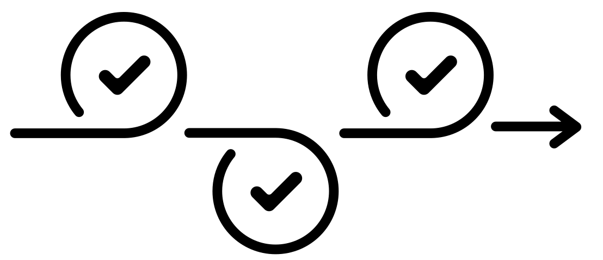

--- 
title: "R community iterative rarefaction"
author: "Matthew R. Gemmell"
date: "`r Sys.Date()`"
site: bookdown::bookdown_site
output: bookdown::gitbook
documentclass: book
bibliography: [book.bib, packages.bib]
biblio-style: apalike
link-citations: yes
favicon: figures/NEOF_favicon.png
description: NEOF book for the R community advanced analysis course
cover-image: "figures/NEOF.png"
---

```{r, echo=FALSE}
#Change colour, border, and text of code chunks
#Check style.css for .Rchunk
#https://stackoverflow.com/questions/65627531/change-r-chunk-background-color-in-bookdown-gitbook
#https://bookdown.org/yihui/rmarkdown-cookbook/chunk-styling.html
knitr::opts_chunk$set(class.source="Rchunk") 
```

```{r cite-packages, include = FALSE}
# automatically create a bib database for R packages
# add any packages you want to cite here
knitr::write_bib(c(
  .packages(), 'bookdown', 'webexercises'
), 'packages.bib')
```

<center>
{style="border-radius: 15px; width: 300px"}
</center>

# (PART\*) Intro {-}

# Introduction

<center>
{style="width: 300px"}
</center>

This book explains and demonstrates how to carry out __iterative rarefaction__ for __alpha__ and __beta__ diversity analysis in __R__ with the `phyloseq` object.
This involves running multiple rounds/iterations of rarefaction and producing an averaged table of __alpha__ and __beta__ diversity values.
This is a more robust method than only carrying out one round of rarefaction.

This book is an optional path for the [main NEOF R community analysis workshop](https://neof-workshops.github.io/R_community_whqkt8/Course)

## Table of contents {-}
```{r, echo=FALSE, align="centre"}
#Create 2 column dataframe
column_1 <- c(
  #1 Background
  '[**Intro**](#iter_rarefaction_background_chap)', 
 '[{style="height:150px; border-radius:15px; background:white"}](#iter_rarefaction_background_chap)',
 #3 Random seed
    '[**Random seeds**](#random_seeds_n_sampling_chap)', 
 '[{style="height:150px"}](#random_seeds_n_sampling_chap)',
 #5 Alpha diversity
   '[**Alpha diversity**](#alpha_chap)', 
 '[{style="height:150px"}](#alpha_chap)'
)
column_2 <- c(
  #2: Setup
  '[**Setup**](#setupchap)', 
 '[{style="height:150px"}](#setupchap)',
 #4 Iterating rarefaction
   '[**Iterating rarefaction**](#iterating_rarefaction_chap)', 
 '[{style="height:100px; border-radius:15px; background:white"}](#iterating_rarefaction_chap)',
 #6 Beta diversity
   '[**Beta diversity**](#beta_chap)', 
 '[{style="height:150px"}](#beta_chap)'
)
table_df <- data.frame(column_1, column_2)
#Kable and kableextra libraries
library(knitr)
library(kableExtra)
#Create table
#ALign both column in centre (align = "cc")
table_df %>%
  kbl(align= "cc", col.names = NULL) %>%
  kable_styling(position = "center")
```

<a rel="license" href="http://creativecommons.org/licenses/by-nc-sa/4.0/"></a><br />This work is licensed under a <a rel="license" href="http://creativecommons.org/licenses/by-nc-sa/4.0/">Creative Commons Attribution-NonCommercial-ShareAlike 4.0 International License</a>.