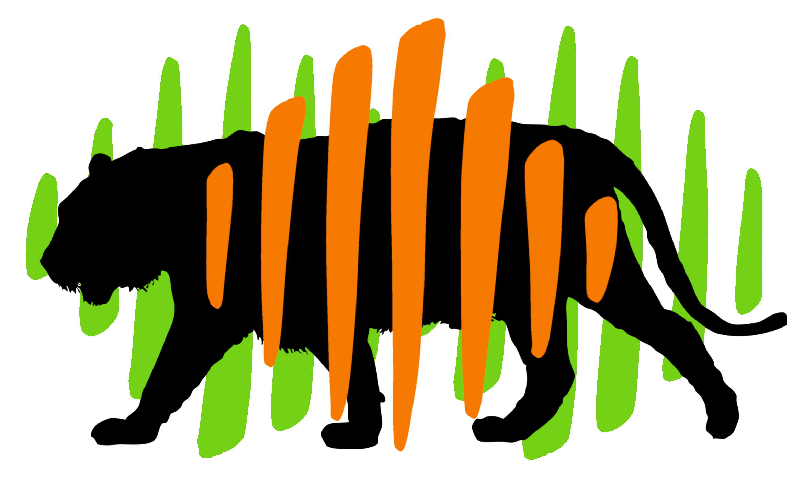

# Multiple Rarefaction iterations
<center>
{style="width:200px; background: white; border-radius:5px; border:5px solid white"}
</center>

This chapter will demonstrate how to use a loop to carry out multiple rounds of rarefaction.
We'll then compare the __non-rarefied__ data to our __iteratively rarefied__ data.

## MR: Rarefaction
<center>
{style="width:300px; background: white; border-radius:5px; border:5px solid white"}
</center>

The below loop creates a rarefied abundance table created by 10 rounds of iteration.
Type the code and read the annotations to understand it.
Then run the code.

```{R, eval=FALSE}
#Iterative rarefaction to produce an average rarefied abundance table

#Assign rarefaction size
rarefaction_size <- min(microbiome::readcount(pseq_env_phyla))
#Load our rng seed vector
load("rngseeds.RData")

#Initialise where we will store the output
#In this case we create the first iteration
#Carry out first rarefaction
pseq_rarefy <- phyloseq::rarefy_even_depth(pseq_env_phyla,
                                           sample.size = rarefaction_size,
                                           #First random seed as the rng seed
                                           rngseed = rngseed_vec[1])
rarefy_phyla_df <- as.data.frame(phyloseq::otu_table(pseq_rarefy))

#Loop through the next 9 iterations
#Add the rarefied values to rarefy_phyla_df
for (i in 2:length(rngseed_vec)){
  #Rarefy
  pseq_rarefy <- phyloseq::rarefy_even_depth(pseq_env_phyla,
                                           sample.size = rarefaction_size,
                                           rngseed = rngseed_vec[i])
  #Add values to rarefy_phyla_df
  rarefy_phyla_df <- 
    rarefy_phyla_df + as.data.frame(phyloseq::otu_table(pseq_rarefy))
}
#Average the values of the summed relabund phyla_table
rarefy_phyla_mean_df <- rarefy_phyla_df / length(rngseed_vec)
#Remove unwanted objects
rm(pseq_rarefy, rarefy_phyla_df)
```

The loop produces a data frame (`rarefy_phyla_df`) that has all the values from the ten rarefied data frames totalled/summed in each corresponding cell. More info on this is under the next heading in this chapter.

The final data frame is then divided by the number of __iterations__ to get the average value for each cell.
This produces the final data frame `rarefy_phyla_mean_df`. 

Let's view the `rarefy_phyla_mean_df` object.

```{R, eval = FALSE}
#View iterative rarefied abundances
rarefy_phyla_mean_df
```

## Mathematical operators & data frames
<center>
{style="width:300px; background:white; border-radius:15px"}
</center>

Two numeric data frames/matrices can be summed together with `+` if they have the same dimensions.
This can be carried out with any mathematical operator (`+`,`-`,`*`,`/`, etc.)
An example of how this works is below.

__Note:__ You don't need to run the below code as the output is displayed.

```{R, eval = TRUE}
#Matrix 1
mat1 <- matrix(1:9, nrow = 3, ncol = 3)
mat1
```
```{R, eval = TRUE}
#Matrix 2
mat2 <- matrix((1:9)*10, nrow = 3, ncol = 3)
mat2
```
```{R, eval = TRUE}
#Summed matrix
mat_sum <- mat1 + mat2
mat_sum
```

If you only use one number with a data frame/matrix the operation will act upon each cell in the same manner.
You could add 1 to each cell, minus 4 from each cell, etc.

Continuing the matrix example, we'll get the average of the 2 data frames by dividins by two (`/2`).

```{R, eval = TRUE}
#Mean matrix
mat_mean <- mat_sum / 2
mat_mean
```

## MR: Difference from non-rarefied
<center>
{style="width:200px"}
</center>

For the purposes of demonstration (not something you would do in normal research) we will compare the phyla relative abundances of the non-rarefied data against the rarefied data with 10 iterations.

### Relative abundance transformation

First we will convert our rarefied counts into relative abundances (i.e. proportional counts by column). However, we can't use `microbiome::transform()` as our rarefied abundances are in a data frame rather than a __phyloseq object__.

To carry this out we can use a few new functions:

- `prop.table()`: Converts all values in a table to proportional values (i.e. sum of all values in table will equal 1).
- [`dplyr::mutate_all()`](https://neof-workshops.github.io/Tidyverse/dplyr/mutate.html): Mutates all columns, in this instance using `prop.table` to proportionalise each column (i.e. each column will sum to 1).
  - [dplyr](https://neof-workshops.github.io/Tidyverse/dplyr/dplyr.html) is part of the [tidyverse package suite](https://neof-workshops.github.io/Tidyverse/)
  
```{R, eval = FALSE}
#Convert to relative abundance table
rarefy_i10_relabund_phyla_df <- dplyr::mutate_all(rarefy_phyla_mean_df, prop.table)
#View relative abundances
rarefy_i10_relabund_phyla_df
```

### Histogram comparison

We'll skip the bar chart this time and only look at the difference of the values of the following tables:

- `as.matrix(phyloseq::otu_table(pseq_env_phyla_relabund)`: Phyla relative abundances based on non-rarefied abundances.
- `rarefy_i10_relabund_phyla_df`: Phyla relative abundances based on rarefied abundances with 10 iterations.

```{R, eval=FALSE}
#Value difference matrix
iterative_rarefaction_diff <- 
  as.matrix(phyloseq::otu_table(pseq_env_phyla_relabund) - rarefy_i10_relabund_phyla_df)
iterative_rarefaction_diff
#Histogram
hist(iterative_rarefaction_diff)
```

```{r, echo = FALSE}
opts_p <- c("__-0.0003(-3e-04) to 0.0003(3e-04)__", answer="__-0.003 to 0.003__", "__-0.015 to 0.015__")
```
What is the range of the differences compared to the non rarefied relative abundance values? `r longmcq(opts_p)`

You should notice that the differences are much smaller compared to the differences found in [chapter 9](#r-difference-from-non-rarefied).
This indicates that the structure of the __iterative rarefied__ data is much closer to the non-rarefied data compared to the one round __rarefied__ data.
This is what we want.